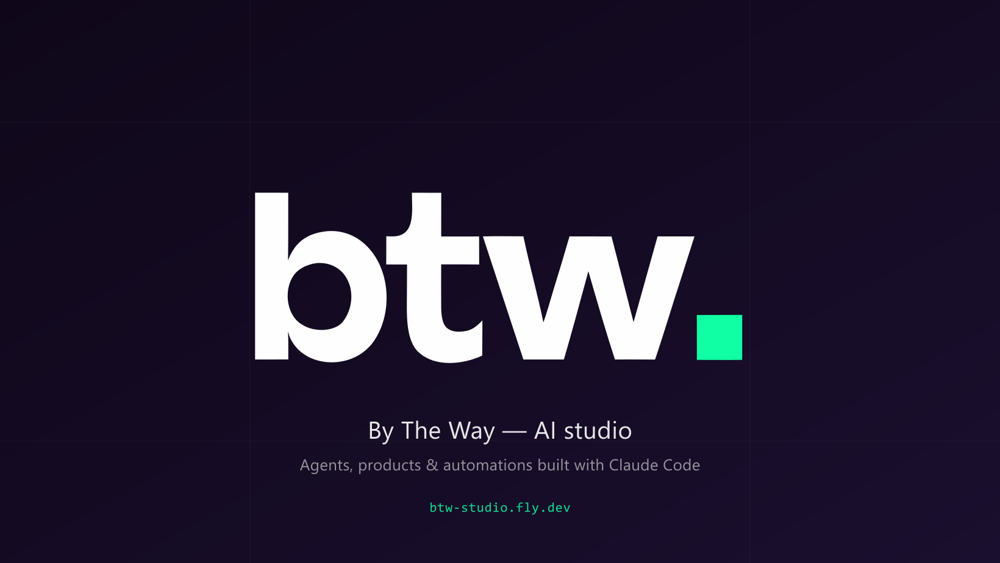
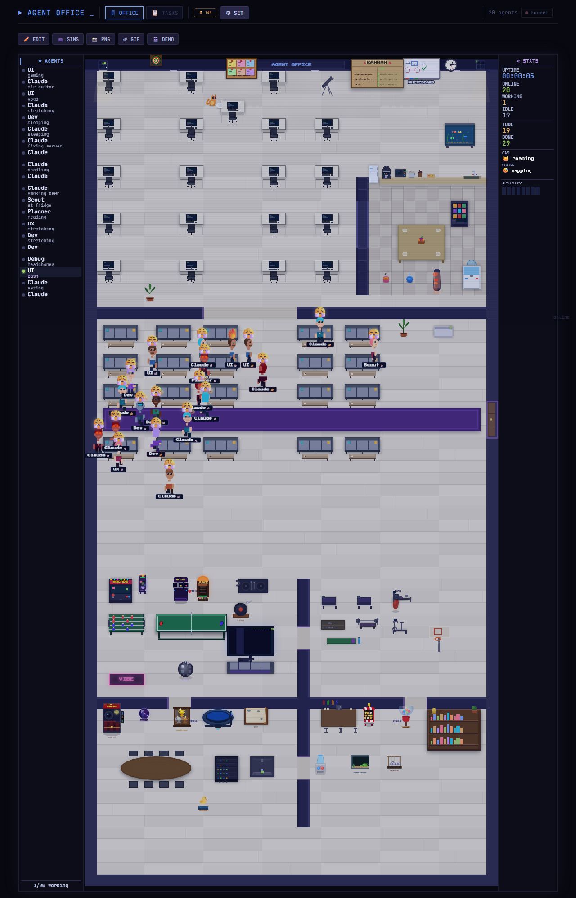

# BTW Studio

**AI systems on demand — agents, automation, Claude-native tooling.**

---

I build AI-driven products and the meta-tooling around them: orchestration frameworks, agent runtimes, sync pipelines, and editorial-grade brand surfaces. Most of what ships here is dogfood for **BTW Studio** — a one-person AI agency where the products *are* the marketing.

## Pinned work

| Project | What it is | Stack |
|---|---|---|
| **[btw-agents-pack](https://github.com/workmailan8n-hash/btw-agents-pack)** | 37 production-tested Claude Code subagents + 17 skills. MIT. | Claude Code, Markdown DSL |
| **[agent-dashboard](https://github.com/workmailan8n-hash/agent-dashboard)** | Pixel-art office where Claude Code agents work in real time. WebSocket-driven. | Node.js, Canvas 2D, WS |
| **[btw-site](https://github.com/workmailan8n-hash/btw-site)** | Editorial dark-luxe brand site. Next.js 15 + r3f + Fly.io. | Next.js 15, R3F, Tailwind |
| **[vault-sync](https://github.com/workmailan8n-hash/vault-sync)** | One-way Obsidian → Notion sync. Frontmatter is the contract. | Node.js, Notion API |

---

### agent-dashboard — Claude Code agents in a pixel-art office

<a href="https://agent-dashboard-production-a178.up.railway.app">live demo →</a>

---

## Stack I ship with

- **AI / LLM** — Claude (Opus / Sonnet / Haiku), Ollama (local Gemma & Llama), OpenRouter, prompt engineering for small models
- **Backend** — TypeScript, Node.js, Prisma, SQLite / Postgres, Supabase, grammY (Telegram)
- **Frontend** — Next.js 15, React 19, react-three-fiber, Tailwind, shadcn/ui
- **Infra** — Fly.io, Railway, Vercel, Cloudflare, Docker
- **Tooling** — Claude Code (heavy user, 50+ custom agents / skills / hooks), Obsidian, Notion API

## What I'm building toward

- **BTW Studio** — AI agency selling bespoke AI systems. Products = portfolio.
- **Nox** — flagship personal AI assistant (local-first, single-user, non-commercial milestone).
- **[@btw_aitech](https://t.me/btw_aitech)** — Ukrainian-language channel about agent engineering & local LLMs.

---

Workspace runs across ~10 active projects. If a repo here looks quiet, it's probably alive in private — ping if you want a tour.
